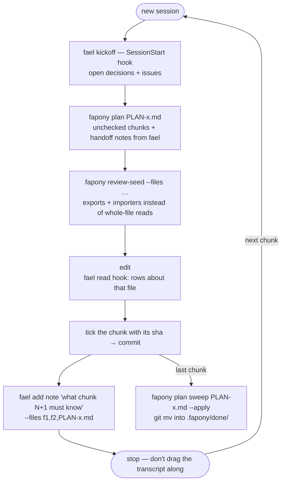
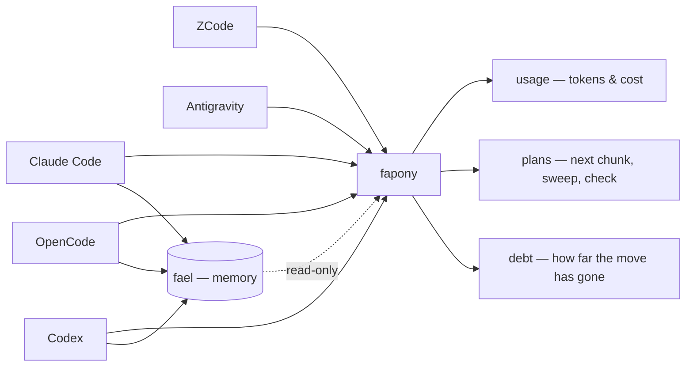

<p align="center">
  
</p>

# fapony

[](https://www.npmjs.com/package/fapony) [](https://github.com/inonix-dev/fapony)

**See what your coding agents actually cost.** fapony reads the session logs Claude Code, Codex,
OpenCode and ZCode already write, and puts them all on one yardstick — tokens, cost and time per
model, per client, per workflow. Nothing to instrument, no per-project setup: it runs on the
history already sitting on your disk.

<p align="center">
  
</p>

```bash
npm install -g fapony       # needs Bun — https://bun.sh
fapony usage-scan           # read the session logs already on your disk
fapony price-scan           # fetch the price table (needed once, for cost)
fapony usage-web            # every session you already have, all clients, one page
```

**Cost is the part your client probably isn't logging.** Of the four, only OpenCode writes a real
dollar figure into its session log — the others record `0`. fapony prices those sessions at
published list rates and labels the number `imputed`; a model it can't find a rate for stays
`unpriced` — nothing is quietly counted as free.

<details>
<summary>full usage-web dashboard preview</summary>

<p align="center">
  
</p>

</details>

Raw facts from logs are hard to argue with — a vendor can dispute a verdict as unfair; they can't
dispute their own token count. That is the whole measurement layer: tokens and cost, nothing
self-graded.

## Past day one

Two more layers, both optional, both compounding:

**Plans, run one chunk at a time.** A long plan in one unbroken session only accumulates context.
`fapony plan` shows every active plan, its progress and next unchecked chunk; `fapony plan PLAN-x.md`
opens one chunk with just the facts it needs — the unchecked boxes, whether the last ticked chunk's
commit really exists, and the notes the previous session left for it — instead of dragging the old
transcript along.

**Memory lives in [fael](https://github.com/inonix-dev/fael).** Decisions, bugs and notes that the
next agent must see used to be fapony's mem log; since 2026-09-25 they are fael's — a single binary
with its own MCP tools and hooks that push the rows about a file when an agent reads it. fapony
reads fael (plan handoff notes, digest, debt recurrence) and never writes it.

**Convention debt.** `fapony debt` answers the question nothing else does: *we decided this six
months ago — how far along is the move?* ESLint says this line is wrong; nothing says 11 of 47
files have migrated. Dead code and duplication it deliberately leaves to knip and friends —
they already do that better.

## The workflow — fapony + fael

Two tools, one loop. **fapony is the workflow** — plans cut into chunks, convention debt, cheap
lookups, what it all cost. **[fael](https://github.com/inonix-dev/fael) is the memory** — the
decisions, bugs and notes the next session must see. Each is useful alone; together they close
the loop: fapony says *what's next*, fael says *what the last session learned*.

| | fapony — workflow | fael — memory |
|---|---|---|
| Owns | plans + chunk loop, `debt`, `lint-baseline`, `review-seed` / `analyze`, usage | decisions, issues, notes (`add` / `find` / `close`) |
| Agent surface | plan-mv guard hook, skills — **no MCP server** | MCP tools + SessionStart / read / Stop hooks |
| Writes | plan files, only when told (`plan sweep --apply`) | its log under `.fael/` in your repo |
| Install | `npm i -g fapony && fapony install` | `npm i -g @inonix/fael && fael install` |

One chunk, one session:



Who reads what:



Adopting it doesn't change your workflow: install it, point your agent at it, read the reports.
Both layers above are per-project (`fapony init`) — plans and debt pay off from the first plan you
cut into chunks and the first convention you declare.

## Quick start

```bash
# 1. Install (needs Bun — https://bun.sh)
npm install -g fapony
#    from source instead:
#    git clone https://github.com/inonix-dev/fapony.git && cd fapony && bun install && bun link
#    (`bun link` claims the global `fapony` bin by package name, not path — re-run it in the
#    checkout you want to be the one)

# 2. Measure — zero per-project setup
fapony usage-scan           # scan the session logs already on disk → cache
fapony price-scan           # fetch the OpenRouter price table → ~/.config/fapony/prices.json
fapony usage-web            # dashboard; re-run the scans to refresh
#    both scans are manual by design — nothing fetches or re-reads session logs behind your back

# 3. Wire your clients
fapony install              # detects installed clients, asks which to wire
fapony install --all        # skip the prompt, wire everything detected
#    claude/opencode also symlink skill/<name>/ into ~/.claude/skills — an existing
#    skill of the same name is reported, never overwritten

# 4. Turn on plans + debt (per project you want them in)
fapony init /path/to/your-worktree
#    creates .fapony/ — plan/ done/ spec/, evidence.json for `fapony report`,
#    and conventions.json for `fapony debt` (shared rules: commit them),
#    then offers to write the plan-loop rules into CLAUDE.md / AGENTS.md
#    (none yet = AGENTS.md + a CLAUDE.md that imports it)
fapony init /path/to/your-worktree --rules --yes   # repo already set up: rules only, no prompt

# 5. Memory: install fael (npm i -g @inonix/fael && fael install)
```

## What fapony is not

Stated up front, because the gap between these two things is where most tooling oversells:

- **It does not run your test suite.** The evidence collector runs an allowlist *you* write in
  `.fapony/evidence.json`, never a command an agent proposes. No allowlist, no evidence.
- **It does not judge your code** — and it holds no memory of its own; that is fael's.
- **It checks conformance, not correctness** — that a claim lines up with git facts and that
  uncertainty was declared, not that the code works.
- **Almost nothing blocks.** The one exception is the plan-mv guard on Claude Code, which denies a
  raw `git mv` of a plan into done/ and points at `fapony plan sweep --apply`; nothing else touches a
  tool call.
- **Model attribution is inferred, not declared** — reports label it `inferred`; read it as such.

## What runs where

`fapony install` wires five clients (Claude Code, OpenCode, ZCode, Codex, Antigravity) — skills
everywhere, plus the plan-mv guard on Claude Code. It also removes hooks fapony no longer ships (the
edit hint, cut 2026-09-26: measured over two windows, it never moved an agent to migrate a file).
Memory hooks and MCP tools are fael's (`fael install`); fapony has no MCP server.

| | Claude Code | OpenCode | ZCode | Codex | Antigravity |
|---|---|---|---|---|---|
| Plan-mv guard — deny raw `git mv` of a plan into done/ | ✅ | — | — | — | — |
| Skills symlinked into `~/.claude/skills` | ✅ | ✅ | — | — | — |
| Skills symlinked into `~/.agents/skills` | — | — | ✅ | ✅ | ✅ |
| `usage-scan` reads this client's session log | ✅ | ✅ | ✅ | ✅ | — |

`—` means not wired, not impossible.

## The work side — conveniences, not the contract

Read-only, deterministic, none of it writes anything. Skip this side entirely and fapony still
works. **Nothing here is a precondition for anything above.**

- `fapony review-seed --files src/thing/` — exports, importers, untested, for roughly a thirtieth
  of the tokens reading those files costs. Before touching an unfamiliar file, fire this and Read
  only the line ranges it points at. Directories work too.
- `fapony digest` — decisions, open bugs, in-flight plans, cost, on one page, from what's already
  on disk.

### Skills

fapony ships seven portable skills, each as `skill/<name>/SKILL.md` — the layout Claude Code
expects, so a client can symlink the directory rather than copy the file:

| Skill | Purpose | Trigger |
|-------|---------|---------|
| `skill/plan-with-pony/` | Draft plan + spec from "what's in your head" via conversation | `/plan-with-pony` |
| `skill/review-pony/` | Review as verification: scope facts before (`review-seed`), a fael row after when findings survive | `/review-pony` |
| `skill/lookup-before-edit/` | Look up unfamiliar files (`review-seed --files` + fael + debt) before reading/editing them | `/lookup-before-edit` |
| `skill/define-convention/` | Turn a not-yet-migrated pattern into a tracked convention (interview + dry-run `debt`) | `/define-convention` |
| `skill/move-to-done/` | Archive a shipped PLAN into .fapony/done/ | `/move-to-done` |
| `skill/git-commit-conventional/` | Commit split by concern + conventional message | `/git-commit` |
| `skill/git-ship/` | Push branch, open PR with drafted title/body, merge, reset branch onto base | `/ship`, `/pr` |

`plan-with-pony` is vendor-neutral — the SKILL.md *is* the prompt, so pipe it to any agent:
`cat skill/plan-with-pony/SKILL.md | claude -p` (or `opencode run`, or anything that reads stdin).
Example plans it produced: [examples/](https://github.com/inonix-dev/fapony/tree/main/examples).

### Plans your agent can answer questions about

Plans stay markdown files in your repo — nothing moves into a database. Four optional frontmatter
keys (`kind` / `status` / `blocked_by` / `blocks`) make a folder of them queryable; plans with no
frontmatter still work, because the unchecked checkboxes are enough. Open the next session with
`fapony plan` — it prints every active plan with its progress and first unchecked chunk without
reading a single 100KB plan body into context:

```
# .fapony/plan/ — 3 active plan(s)

- PLAN-calendar.md — 1/4 chunks · priority:high
  next: chunk 2 — move overdue out
- PLAN-billing.md — 0/3 chunks · blocked_by: PLAN-calendar.md
  next: chunk 1 — money type
```

`fapony plan PLAN-calendar.md` then shows that plan's unchecked chunks, whether the last ticked
chunk's sha is really in git, and the open fael notes about it — close a chunk with
`fael add note "<what chunk N+1 must know>" --files <f>,<PLAN path>` and the next session finds it.

**There is no `MASTER.md`** — every line above is derived from the plan files themselves, so it
cannot drift; a hand-kept master file always does. `fapony plan check` verifies ticked chunk
shas against git history (a ticked box with no sha to check is a claim, not a close) and flags
dangling `blocked_by` refs; `fapony plan sweep PLAN-x.md --apply` archives a shipped plan with `git mv`
into `.fapony/done/` — same name, same depth, so every relative link inside the file survives the
move. Specs live in `.fapony/spec/` and are never archived.

## CLI

```bash
# core: plans + debt (memory — decisions, bugs, notes — lives in fael)
fapony plan [<PLAN.md>]                    # active plans + next chunk; one plan: unchecked chunks + open fael rows
fapony plan sweep [<PLAN.md>] [--apply]    # archive shipped plans into done/ + rewrite links
fapony plan check [--quiet]                # deps, broken links, ticked-chunk shas (exit 1 on issues)
fapony debt [--id a,b] [--where <path>]    # which files haven't migrated to a declared convention (live, read-only)
fapony lint-baseline [--cmd ...] [--diff]  # separate "already red" from "I made it red"
fapony digest [--since 7d|YYYY-MM-DD] [--format text|html] [--json] [--out FILE]  # single-page summary from what's on disk

# usage (day one)
fapony usage-scan                          # scan session logs → cache (incremental, progress bar)
fapony price-scan                          # fetch model price table → prices.json (cache; query never fetches)
fapony usage-web [port]                    # usage comparison dashboard from cache

# lookup (read-only, never touches state)
fapony analyze [path]                      # live repo graph: hubs, orphans, cycles, changed-untested (TS/JS + Python .py/.pyi; stdlib→external, no sys.path)
fapony review-seed [--staged|--commit <sha>|--range <a...b>|--files f1,f2,dir|--plan <PLAN.md>] [--body sym[,sym]] [--callers sym[,sym]]  # scope facts for a review
fapony plan-seed <name> [--spec] [--scope <path>[,<path>]]...  # write PLAN (+SPEC): frontmatter, capped sections, prior-art list

# hooks (wired by `fapony install`, not run by hand)
fapony hook-mv-guard                       # deny raw git mv of plan files into done/

# frozen ledger (reads history only — the grading tool left the MCP surface in 2026-09)
fapony stats [--mode verdict [--regime code|fix|review|plan|inquiry|test]]  # KPIs from old graded runs
fapony report <run-id>                     # verification report for a run
fapony report-web [file]                   # static HTML report page

# setup & maintenance
fapony init <path>                         # scaffold .fapony/ (plan/done/spec/evidence)
fapony install [--all|--platform <name>|--dry-run]  # wire skills + plan-mv guard into clients
fapony setup                               # interactive wizard: config + scaffold in one step
fapony update                              # self-update via git pull
fapony telemetry show|send                 # opt-in only, default off — see TELEMETRY.md
```

`fapony report <run-id>` prints the full report for a frozen-ledger run — git facts, handoff
conformance, allowlisted evidence, the stored verdict, cost — with anything the agent claimed but
couldn't prove marked as such. Reports are stamped with the producing build's `server_sha`; after
editing fapony, compare the stamp against `git log -1` before trusting a report. Each allowlisted command gets `timeout_ms` (default 30s), the whole report
capped at 180s — a command that doesn't fit reports as `timeout`, never as a pass. If your
`.gitignore` ignores `.fapony/` wholesale, re-include the file: `**/.fapony/*`, then
`!**/.fapony/evidence.json`.

## Config

`fapony.config.json` lives in the fapony checkout and is gitignored (it's per-machine). Copy
[fapony.config.example.json](https://github.com/inonix-dev/fapony/blob/main/fapony.config.example.json)
for a complete working reference; every section is optional. Key fields: `worktrees`
(name → path), `memory` (shell commands the frozen ledger runs; off unless set), `paths` / `safety`,
`usageWeb { port, hostname }`. Env overrides: `FAPONY_CONFIG`, `FAPONY_STATE_DIR` (state DB;
default `~/.config/fapony/`).

## Scope

**Supported:** cross-client usage on one yardstick · per-project plans + convention debt ·
per-client hooks ([matrix above](#what-runs-where)) ·
vendor-neutral skills (anything that reads stdin) · opt-in telemetry, off by default
([TELEMETRY.md](https://github.com/inonix-dev/fapony/blob/main/TELEMETRY.md) lists exactly what
leaves the machine) · Bun-only; run state in SQLite via `bun:sqlite` (WAL mode).

**Not supported (yet):** the plan-mv guard outside Claude Code. Memory of any
kind — that is [fael](https://github.com/inonix-dev/fael). A hosted or shared ledger —
`FAPONY_STATE_DIR` on a synced folder works as an experiment only; SQLite's WAL mode does not
tolerate concurrent writers over NFS/Dropbox/iCloud Drive and can corrupt the db under real
contention.

## License

MIT
