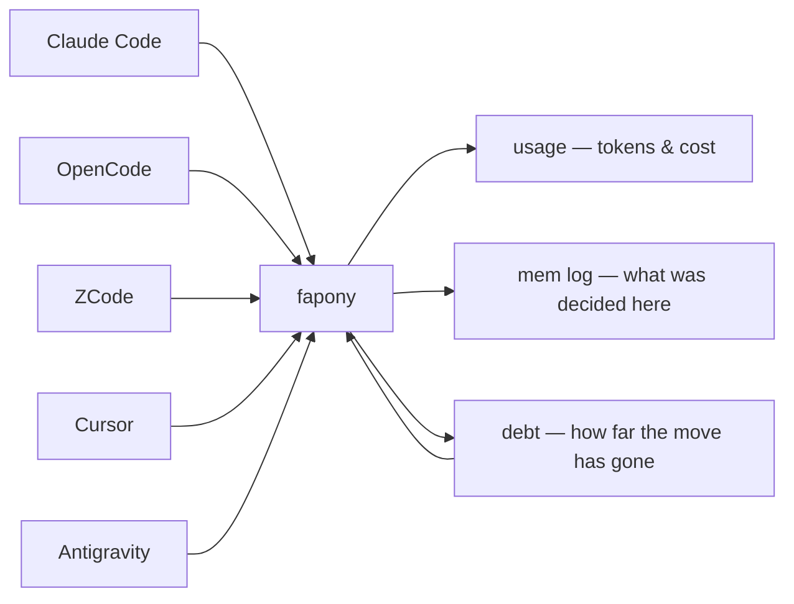

<p align="center">
  
</p>

# fapony

[](https://www.npmjs.com/package/fapony)

**See what your coding agents actually cost.** fapony reads the session logs Claude Code, Codex,
OpenCode and ZCode already write, and puts them all on one yardstick — tokens, cost and time per
model, per client, per workflow. Nothing to instrument, no per-project setup: it runs on the
history already sitting on your disk.

<p align="center">
  
</p>

```bash
npm install -g fapony       # needs Bun — https://bun.sh
fapony usage-scan           # read the session logs already on your disk
fapony price-scan           # fetch the price table (needed once, for cost)
fapony usage-web            # every session you already have, all clients, one page
```

**Cost is the part your client probably isn't logging.** Of the four, only OpenCode writes a real
dollar figure into its session log — the others record `0`. fapony prices those sessions at
published list rates and labels the number `imputed`; a model it can't find a rate for stays
`unpriced` — nothing is quietly counted as free.

<details>
<summary>full usage-web dashboard preview</summary>

<p align="center">
  
</p>

</details>

Raw facts from logs are hard to argue with — a vendor can dispute a verdict as unfair; they can't
dispute their own token count. That is the whole measurement layer: tokens and cost, nothing
self-graded.

## Past day one

Two more layers, both optional, both compounding:

**Memory — the mem log.** An agent has no memory of pain across sessions: it writes the 37th
hand-rolled `try/catch` as cheerfully as the first, because every session starts new. Wrappers
and shared libraries get built by *people* who were hurt often enough to remember. fapony
remembers instead: one MCP call per unit of work (`mem_add`) records the decision, bug or note
with the files it touched, and `mem_find` answers *"what was ever decided about this file?"*
before the next agent touches it. The log lives in your repo (`.fapony/.memory/`), so it crosses
machines over git for free.

**Convention debt.** `fapony debt` answers the question nothing else does: *we decided this six
months ago — how far along is the move?* ESLint says this line is wrong; nothing says 11 of 47
files have migrated. Dead code and duplication it deliberately leaves to knip and friends —
they already do that better.



Adopting it doesn't change your workflow: install it, point your agent at it, read the reports.
Both layers above are per-project (`fapony init`) and worthless on run 1 — they get more useful
every run after, which is exactly why they're retention, not the reason to install.

## Quick start

```bash
# 1. Install (needs Bun — https://bun.sh)
npm install -g fapony
#    from source instead:
#    git clone https://github.com/kire21b/fapony.git && cd fapony && bun install && bun link
#    (`bun link` claims the global `fapony` bin by package name, not path — re-run it in the
#    checkout you want to be the one)

# 2. Measure — zero per-project setup
fapony usage-scan           # scan the session logs already on disk → cache
fapony price-scan           # fetch the OpenRouter price table → ~/.config/fapony/prices.json
fapony usage-web            # dashboard; re-run the scans to refresh
#    both scans are manual by design — nothing fetches or re-reads session logs behind your back

# 3. Wire your clients
fapony install              # detects installed clients, asks which to wire
fapony install --all        # skip the prompt, wire everything detected
#    claude/opencode also symlink skill/<name>/ into ~/.claude/skills — an existing
#    skill of the same name is reported, never overwritten

# 4. Turn on the memory layer (per project you want it in)
fapony init /path/to/your-worktree
#    creates .fapony/ — .memory/ (the mem log the 3 MCP tools read and write)
#    and conventions.json for `fapony debt` (shared rules: commit them)
```

…or add it manually to any MCP client: `{ "mcpServers": { "fapony": { "command": "fapony", "args": ["mcp"] } } }`. Full protocol and adapter examples: [docs/mcp-handcheck.md](https://github.com/kire21b/fapony/blob/main/docs/mcp-handcheck.md).

## What fapony is not

Stated up front, because the gap between these two things is where most tooling oversells:

- **It does not run your test suite.** The evidence collector runs an allowlist *you* write in
  `.fapony/evidence.json`, never a command an agent proposes. No allowlist, no evidence.
- **It does not judge your code.** Mem rows *record* what a human or a working agent supplies.
  fapony is the memory, not the judge.
- **It checks conformance, not correctness** — that a claim lines up with git facts and that
  uncertainty was declared, not that the code works.
- **Almost nothing blocks.** The one exception is the Stop hook, once per turn when a commit
  lands with no new mem row; everything else only annotates.
- **Model attribution is inferred, not declared** — reports label it `inferred`; read it as such.
- **The knowledge layer is empty on run 1** — worth something around run 5, more every run after.

## What runs where

`fapony install` wires six clients (Claude Code, OpenCode, Cursor, ZCode, Codex, Antigravity). MCP is
the only piece all of them get — the hooks and in-process hints are per-client, and the read/edit
hints arrive **before** the call on Claude Code but **after** it on OpenCode, whose only annotate
channel is `tool.execute.after`. Nothing here is required: skip the hooks and every MCP tool still
answers.

| | Claude Code | OpenCode | Cursor | ZCode | Codex | Antigravity |
|---|---|---|---|---|---|---|
| MCP tools — `mem_find` `mem_add` `mem_close` | ✅ | ✅ | ✅ | ✅ | ✅ | ✅ |
| Stop hook — refuse to end a turn with commits but no new mem row | ✅ | — | ✅ | — | ✅ after trust | — |
| Read hint — big-file pointer + debt/mem lines | ✅ before | ✅ after | — | — | — | — |
| Re-read hint — unchanged repeat read | ✅ before | ✅ after | — | — | — | — |
| Edit hint — importer count before a shape change | ✅ before | ✅ after | — | — | — | — |
| Commit hint — `git commit` → record-a-mem-row nudge | — | ✅ after | — | — | — | — |
| Skills symlinked into `~/.claude/skills` | ✅ | ✅ | — | — | — | — |
| Skills symlinked into `~/.agents/skills` | — | — | — | ✅ | ✅ | ✅ |
| `usage-scan` reads this client's session log | ✅ | ✅ | — | ✅ | ✅ | — |

`—` means not wired, not impossible. Codex hooks require trust via `/hooks` before they run —
`fapony install` tells you when. Antigravity gets MCP + skills now; its hook surface is still
evolving, and `usage-scan` can't read its session log yet. The hints live on hooks rather than MCP
on purpose — they must fire mid-turn without the agent deciding to call anything.

## The ledger — one habit, 3 tools

One habit feeds it: record a mem row when a unit of work ends. Everything else on this page is
optional around that. The **Stop hook** is the only thing fapony *blocks* — once per turn, when a
commit lands with no new mem row. It never judges what deserves recording. The hints only
annotate: a big-file read points at `review-seed`, a repeat read of an unchanged file points at
grep, an edit names the file's importer count before you change its shape.

| Tool | Purpose |
|------|---------|
| `mem_find` | Search the project's mem log read-only — matched on the row's `files[]` (text substring for older rows), `text`, `kind` (no default filter), `since` |
| `mem_add` | Append a mem row (decision/bug/note/next/hold) with `files[]` required and rejected when empty — the write half of `mem_find` |
| `mem_close` | Close a mem row by id with a tombstone message — a separate tool because a close row carries no `files[]` |

**A tool earns its schema by being called mid-task without being asked.** Everything you invoke
deliberately is a CLI command instead: a tool schema is paid as input tokens in every session of
every client whether or not it is used, while a CLI command costs nothing until it runs. That is
why `stats`, `report`, `usage-web` and friends are CLI-only, and why four tools left the MCP
surface in 2026-09 — the 3 mem tools keep their schemas because nobody is going to type them at
the right moment.

## The work side — conveniences, not the contract

Read-only, deterministic, none of it writes anything. Skip this side entirely and fapony still
works. **Nothing here is a precondition for anything above.**

- `fapony review-seed --files src/thing/` — exports, importers, untested, for roughly a thirtieth
  of the tokens reading those files costs. Before touching an unfamiliar file, fire this and Read
  only the line ranges it points at. Directories work too.
- `fapony digest` — decisions, open bugs, in-flight plans, cost, on one page, from what's already
  on disk.

### Skills

fapony ships seven portable skills, each as `skill/<name>/SKILL.md` — the layout Claude Code
expects, so a client can symlink the directory rather than copy the file:

| Skill | Purpose | Trigger |
|-------|---------|---------|
| `skill/plan-with-pony/` | Draft plan + spec from "what's in your head" via conversation | `/plan-with-pony` |
| `skill/review-pony/` | Review as verification, wired to fapony: scope facts before (`review-seed`), a mem row after when findings survive | `/review-pony` |
| `skill/lookup-before-edit/` | Look up unfamiliar files (`review-seed --files` + mem + debt) before reading/editing them | `/lookup-before-edit` |
| `skill/define-convention/` | Turn a not-yet-migrated pattern into a tracked convention (interview + dry-run `debt`) | `/define-convention` |
| `skill/move-to-done/` | Archive a shipped PLAN into .fapony/done/ | `/move-to-done` |
| `skill/git-commit-conventional/` | Commit split by concern + conventional message | `/git-commit` |
| `skill/git-ship/` | Push branch, open PR with drafted title/body, merge, reset branch onto base | `/ship`, `/pr` |

`plan-with-pony` is vendor-neutral — the SKILL.md *is* the prompt, so pipe it to any agent:
`cat skill/plan-with-pony/SKILL.md | claude -p` (or `opencode run`, or anything that reads stdin).
Example plans it produced: [examples/](https://github.com/kire21b/fapony/tree/main/examples).

### Plans your agent can answer questions about

Plans stay markdown files in your repo — nothing moves into a database. Four optional frontmatter
keys (`kind` / `status` / `blocked_by` / `blocks`) make a folder of them queryable; plans with no
frontmatter still work, because the unchecked checkboxes are enough. Open the next session with
`fapony mem kickoff` — it prints what is next (priority plans, the first unchecked chunk of each,
open bugs) without reading a single 100KB plan body into context:

```
## next up
  [1] chunk 2 — move overdue out (PLAN-calendar.md)
  [2] bug #mu8t5qve — money drifts in the month grid…
      → fapony mem close mu8t5qve "<msg>"
  [3] last touched: src/quick/month.tsx, src/lib/money.ts
```

**There is no `MASTER.md`** — every line above is derived from the plan files themselves, so it
cannot drift; a hand-kept master file always does. `fapony mem plan-check` verifies ticked chunk
shas against git history (a ticked box with no sha to check is a claim, not a close) and flags
dangling `blocked_by` refs; `fapony mem plan-sweep --apply` archives a shipped plan with `git mv`
into `.fapony/done/` — same name, same depth, so every relative link inside the file survives the
move. Specs live in `.fapony/spec/` and are never archived.

## CLI

```bash
# core: memory + debt
fapony mem add <kind> "<text>" --files f1,f2 [--key k] [spec.md]   # append a mem row (decision/bug/note/next/hold)
fapony mem close <id> "<msg>"              # close a row (a bug stays open without this)
fapony mem find ["<text>"] [--kind a,b] [--files f1,f2] [--since <N>d|YYYY-MM-DD] [--limit n] [--open]  # search mem log
fapony mem kickoff [<plan.md>] [--pick <n>]  # open a session + a next-up list
fapony mem where                           # show the resolved mem dir and which step won
fapony mem done | stale | claim | release | synced | plan-sweep | plan-check | rotate
fapony debt [--id a,b] [--where <path>]    # which files haven't migrated to a declared convention (live, read-only)
fapony lint-baseline [--cmd ...] [--diff]  # separate "already red" from "I made it red"
fapony init-mem                            # delete legacy .memory/ dirs + warn call sites still referencing them
fapony digest [--since 7d|YYYY-MM-DD] [--format text|html] [--json] [--out FILE]  # single-page summary from what's on disk

# usage (day one)
fapony usage-scan                          # scan session logs → cache (incremental, progress bar)
fapony price-scan                          # fetch model price table → prices.json (cache; query never fetches)
fapony usage-web [port]                    # usage comparison dashboard from cache

# lookup (read-only, never touches state)
fapony analyze [path]                      # live repo graph: hubs, orphans, cycles, changed-untested
fapony review-seed [--staged|--commit <sha>|--range <a...b>|--files f1,f2,dir|--plan <PLAN.md>]  # scope facts for a review
fapony plan-seed <name> [--spec] [--scope <path>[,<path>]]...  # write PLAN (+SPEC): frontmatter, capped sections, prior-art list

# hooks & MCP (wired by `fapony install`, not run by hand)
fapony mcp                                 # MCP server (stdio JSON-RPC — 3 tools)
fapony hook-stop                           # Stop hook: block turns with commits but no mem row
fapony hook-read-hint                      # read/re-read annotations
fapony hook-edit-hint                      # importer count before editing shape
fapony hook-mv-guard                       # deny raw git mv of plan files into done/
fapony hook-session-start                  # SessionStart: kickoff into context

# frozen ledger (reads history only — the grading tool left the MCP surface in 2026-09)
fapony stats [--mode verdict [--regime code|fix|review|plan|inquiry|test]]  # KPIs from old graded runs
fapony report <run-id>                     # verification report for a run
fapony report-web [file]                   # static HTML report page

# setup & maintenance
fapony init <path>                         # scaffold .fapony/ (plan/spec/memory/evidence)
fapony install [--all|--platform <name>|--dry-run]  # wire MCP + skills into clients
fapony setup                               # interactive wizard: config + scaffold in one step
fapony update                              # self-update via git pull
fapony telemetry show|send                 # opt-in only, default off — see TELEMETRY.md
```

`fapony report <run-id>` prints the full report for a frozen-ledger run — git facts, handoff
conformance, allowlisted evidence, the stored verdict, cost — with anything the agent claimed but
couldn't prove marked as such. Reports are stamped with the producing build's `server_sha`; after
editing fapony, compare the stamp against `git log -1` before trusting a report from a
long-lived MCP server. Each allowlisted command gets `timeout_ms` (default 30s), the whole report
capped at 180s — a command that doesn't fit reports as `timeout`, never as a pass. If your
`.gitignore` ignores `.fapony/` wholesale, re-include the file: `**/.fapony/*`, then
`!**/.fapony/evidence.json`.

*When* to call `mem add` is your project's call, not fapony's — write it in your own
`AGENTS.md`/`CLAUDE.md`. A starting point:

```markdown
## Memory
- Found a bug while working (not just user-reported)? Log it before fixing:
  mem_add { kind: "bug", worktree: "<absolute app dir>", files: [...], text: "..." }
- `text` must stand alone — read months later with no chat context: what/where/repro/status.
- Don't fold the fix into the same chunk — log first, fix as its own next/chunk if you do.
```

## Config

`fapony.config.json` lives in the fapony checkout and is gitignored (it's per-machine). Copy
[fapony.config.example.json](https://github.com/kire21b/fapony/blob/main/fapony.config.example.json)
for a complete working reference; every section is optional. Key fields: `worktrees`
(name → path), `memory` (shell commands, or `null` to disable), `paths` / `safety`,
`usageWeb { port, hostname }`. Env overrides: `FAPONY_CONFIG`, `FAPONY_STATE_DIR` (state DB;
default `~/.config/fapony/`), `FAPONY_NO_REREAD_HINT=1`.

## Scope

**Supported:** MCP server (3 mem tools, any MCP client) · cross-client usage on one yardstick ·
per-project mem log + convention debt · per-client hooks ([matrix above](#what-runs-where)) ·
vendor-neutral skills (anything that reads stdin) · opt-in telemetry, off by default
([TELEMETRY.md](https://github.com/kire21b/fapony/blob/main/TELEMETRY.md) lists exactly what
leaves the machine) · Bun-only; run state in SQLite via `bun:sqlite` (WAL mode).

**Not supported (yet):** PreToolUse hints on Cursor, ZCode, Codex or Antigravity — Cursor has no
such hook, the other two expose no in-process hook surface for read/edit hints, and Antigravity's
hook surface is still evolving. A hosted or shared ledger —
`FAPONY_STATE_DIR` on a synced folder works as an experiment only; SQLite's WAL mode does not
tolerate concurrent writers over NFS/Dropbox/iCloud Drive and can corrupt the db under real
contention.

## License

MIT
