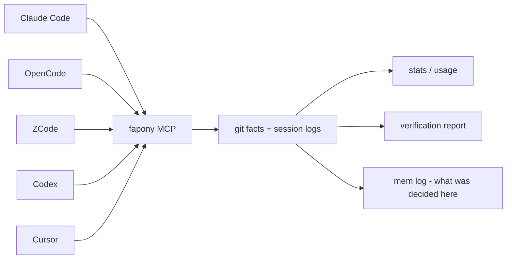
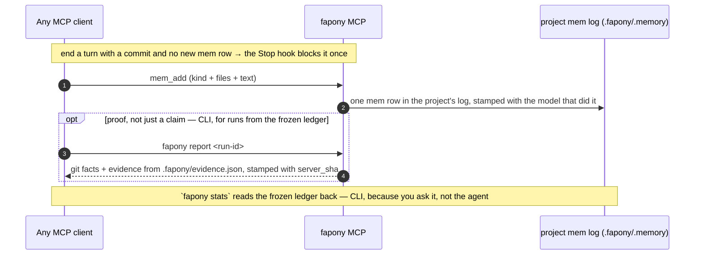
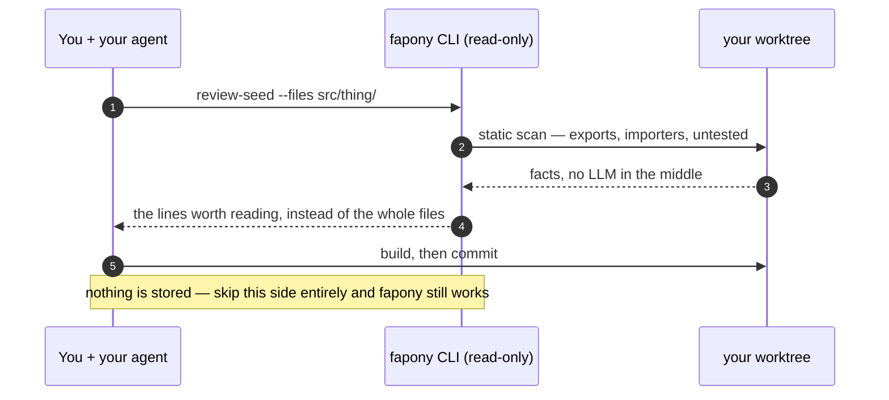
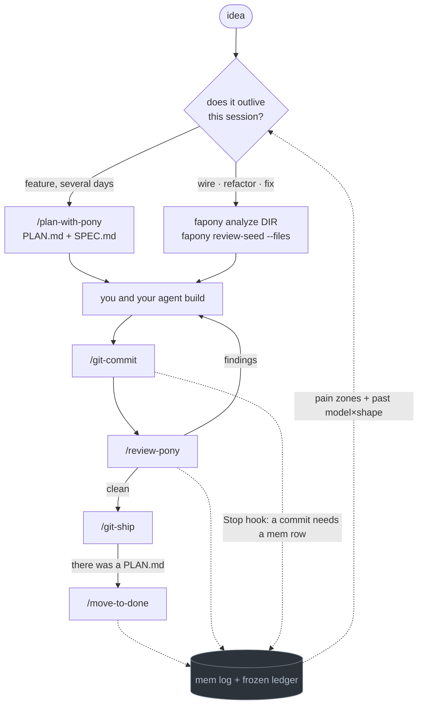

<p align="center">
  
</p>

# fapony

[](https://www.npmjs.com/package/fapony)

**Where did your tokens go?** fapony reads the session logs Claude Code, Codex, OpenCode and ZCode
already write, and puts them all on one yardstick — tokens, cost and time per model, per client,
per workflow. Nothing to instrument, no per-project setup, no waiting for data to accumulate: it
runs on the history already sitting on your disk.

<p align="center">
  
</p>

```bash
fapony usage-scan       # read the session logs already on your disk
fapony price-scan       # fetch the price table (needed once, for cost)
fapony usage-web        # every session you already have, all clients, one page
```

**Cost is the part your client probably isn't logging.** Of the four, only OpenCode writes a real
dollar figure into its session log — Claude Code, ZCode and Codex record `0`. fapony prices those
sessions at published list rates and labels the number `imputed`, so a figure you can compare
across clients exists at all. A model it can't find a rate for stays `unpriced`: nothing is
quietly counted as free.

<details>
<summary>full usage-web dashboard preview</summary>

<p align="center">
  
</p>

</details>

That is day one. Past that, fapony keeps what coding agents actually did — the frozen
ledger of graded runs (rounds, pass/fail, cost per grade, readable via CLI, no new grades)
plus the live mem log — through 3 MCP tools any agent can call. If you juggle more than
one agent, this is the point: the numbers come from the same yardstick everywhere, so
"which model earns its keep on which kind of task" becomes a data question instead of a
vibe. On top of history it checks claims against git facts: handoff conformance and
allowlisted evidence — with everything the agent claimed but couldn't prove marked as such.

**What that question looks like answered, from one project's own (frozen — reads history,
no new grades) ledger — the top of the `n≥5` frontier (`fapony stats --mode verdict --regime code`):**

| model | tokens/pass | quality | n |
|---|---|---|---|
| `mimo-v2.5` | 3.9M | 4.0 | 9 |
| `deepseek-v4.1-flash` | 2.3M | 3.9 | 19 |
| `z-ai/glm-5.3-flash` | 1.2M | 3.8 | 9 |

Same quality band, a 3.3× token spread — the kind of answer a session log can't give (it has tokens,
no grades) and a benchmark can't give either (it has grades, not your codebase). One caveat that's
on you to hold: work isn't randomly assigned to models, so a gap this size is a strong prior, not a
controlled trial — you likely route easy tasks to the cheap model already. `n≥5` is fapony's own
floor before a model counts toward the frontier at all; below that it's a data point, not a pick.

**The reason to keep it running is the third layer: knowledge accumulation — and the thing it
accumulates is pain.** An agent has no memory of pain across sessions: it writes the 37th
hand-rolled `try/catch` as cheerfully as the first, because every session starts new. Wrappers and
shared libraries get built by *people* who were hurt by the same thing often enough to remember.
That is why a codebase written with agents from day one tends not to grow a shared layer — nobody
in the room remembers. fapony is the part that remembers: mem rows carry
`files[]`, so the zones that keep coming back in re-done work are a query, not a hunch
(the frozen ledger's old graded rows carry them too).
Paired with `fapony debt`, which tracks how far the codebase has actually moved to a convention you
already decided on, that is the loop: notice the repeated cost, name the shared thing, watch the
migration finish. Finding dead code and duplication is *not* part of it — knip and friends already
do that better, and a convention with a `checker` is deliberately left to the checker.

**The measurement layer underneath it:** Any single client already logs its own session — timing, tokens, tool calls. What none of them see is *across* runs, clients and task shapes: which model earns its keep on which kind of work **in this project**, at what token cost. The frozen ledger still answers that from history — every old verdict carries a `regime` (`code` / `fix` / `review` / `plan` / `inquiry` / `test`), and runs split by whether there was a plan at all — so "does planning beat diving in, and for which model" stays a table, not an argument. New accumulation goes to the mem log instead: decisions, bugs and notes with `files[]`, written by the agents doing the work.

Three tiers, deliberately: **measurement ships today** and needs no per-project setup — raw facts nobody can call unfair. **Verification is the sharper edge** but stays beta until its evidence layer is hardened; fapony doesn't control your agent's flow, so it never promises "verified" as a headline. **Knowledge accumulation is the compounding one** — it's worthless on run 1 and gets more useful every run after, which is exactly why it's the layer competitors can't clone by copying a feature list.

Adopting it doesn't change your workflow. There is no loop to join and no framework to learn: install the MCP server, point your agent at it, and read the reports. fapony also ships plans, skills and read-only seed commands from its own dogfooding — those are conveniences, kept in their own section below, and deleting all of them costs you nothing the ledger can measure.

## What fapony is not

Stated up front, because the gap between these two things is where most tooling oversells:

- **It does not run your test suite.** The evidence collector runs an allowlist *you* write in
  `.fapony/evidence.json`, and never a command an agent proposes. No allowlist, no evidence.
- **It does not judge your code.** Mem rows *record* decisions, bugs and notes; a human or
  a working agent supplies them. fapony is the memory, not the judge. (The frozen
  ledger's old grades work the same way — *stored*, never computed.)
- **It checks conformance, not correctness.** What it can verify is that a claim lines up with git
  facts and that uncertainty was declared — not that the code works. Those are different
  guarantees and fapony only offers the first.
- **Almost nothing blocks.** No CI failure, no gate on your own commands. The one exception is the
  Stop hook, once per turn when a commit lands with no new mem row; the read/edit/commit hints only annotate.
  Skip the install of all of them and you are back to exactly the workflow you had.
- **Model attribution is inferred, not declared.** A gate in the frozen ledger is attributed to whichever client
  session was live in that worktree at that moment. When one model writes the code and another
  reviews and files the verdict, the grade lands on the reviewer. Reports label it `inferred`;
  read it as such.
- **The knowledge layer is empty on run 1.** It is worth something around run 5 and more every run
  after.

## Quick start (MCP)

```bash
# 1. Install (needs Bun — https://bun.sh)
npm install -g fapony       # or: bun add -g fapony
#    from source instead:
#    git clone https://github.com/kire21b/fapony.git && cd fapony && bun install && bun link
#    note: `bun link` claims the global `fapony` bin by package name, not path — running it
#    from a second checkout silently repoints the command there. Re-run it in the one you want.

# 2. Wire it into your MCP client
fapony install                            # detects installed clients, asks which to wire
fapony install --all                      # skip the prompt, wire everything detected
#    use --platform <name> to force a specific client (bypasses detection)
#    zcode/codex need their config to exist first — open the app once if you never have
#    claude/opencode also symlink skill/<name>/ into ~/.claude/skills — an existing
#    skill of the same name is reported, never overwritten
# …or add it manually to any MCP client (e.g. Claude Desktop):
# { "mcpServers": { "fapony": { "command": "fapony", "args": ["mcp"] } } }

# 3. Measure — zero per-project setup
fapony usage-scan                         # scan the session logs already on disk → cache
fapony price-scan                         # fetch the OpenRouter price table → ~/.config/fapony/prices.json
fapony usage-web                          # dashboard; re-run the scans to refresh
#    both scans are manual by design — nothing fetches or re-reads session logs behind your back

# 4. Turn on the knowledge layer (per project you want it in)
fapony init /path/to/your-worktree
#    creates .fapony/ — .memory/ (the mem log the 3 MCP tools read and write),
#    conventions.json for `fapony debt`, plan/spec/done, and evidence.json
#    conventions.json + evidence.json are shared rules: commit them
```

With `.fapony/evidence.json` in place, any graded run from the frozen ledger can be replayed
as a report. This one is a CLI command, not an MCP tool — the schemas cost every session of
every client and no skill called them (see [The 3 tools](#the-3-tools) below). No new runs
can be created; run ids come from `fapony stats` reading history:

```bash
fapony report <run-id>        # run ids come from `fapony stats`
```

You get one report: git facts (files, commits, branch), handoff conformance (claims vs. reality), evidence from the allowlisted commands (pass/fail/timeout/unverified), the frozen 6-grade verdict, and cost — with anything the agent claimed but couldn't prove marked as such.

Sections that have nothing to report say so (`not_run`, `unavailable`) rather than disappearing — a report with no evidence must not read like a report that passed.

Two details for the allowlist once it is under version control. If your `.gitignore` ignores `.fapony/` wholesale, re-include the file (dir before file): `**/.fapony/*`, then `!**/.fapony/evidence.json`. In a monorepo, give an app its own `apps/<app>/.fapony/evidence.json` — reports whose changed files all sit under that app use it; anything else uses the root one.

Two things worth knowing about the report header and budget:

- **`server_sha`** — every report is stamped with the git SHA of the fapony code that produced it, read once at server start. MCP servers are long-lived: after you edit fapony and don't restart the client, reports keep coming from the old build. Compare the stamp against `git log -1` in the fapony repo; if they differ, reconnect the server before trusting the result.
- **Evidence budget** — each allowlisted command gets `timeout_ms` (default 30s), and the whole report is capped at 180s total. A command that doesn't fit is reported as `timeout`, never as a pass. Time your real suite and set `timeout_ms` accordingly.

## How it fits



fapony never drives the agent. It sits on two sides of your work that never touch each
other, and **the rest of this README is organised along that line**: the ledger below is the
product, and everything under "The work side" after it is a convenience you can delete without
losing a single number.

| | The ledger | The work side |
|---|---|---|
| What it is | 3 MCP tools (mem) + a frozen SQLite ledger (reads history) | plans, skills, read-only seed commands |
| Needs | an MCP client | nothing — or your own tooling instead |
| Writes | one mem row per unit of work, into the project's log | nothing |
| Skip it and | there is no fapony | fapony still answers every question |

### What runs where

`fapony install` wires five clients (Claude Code, OpenCode, Cursor, ZCode, Codex). MCP is the only
piece all of them get — the hooks and in-process hints are per-client, and the read/edit hints
arrive **before** the call on Claude Code but **after** it on OpenCode, whose only annotate channel
is `tool.execute.after`. Nothing here is required: skip the hooks and every MCP tool still answers.

| | Claude Code | OpenCode | Cursor | ZCode | Codex |
|---|---|---|---|---|---|
| MCP tools — `mem_find` `mem_add` `mem_close` | ✅ | ✅ | ✅ | ✅ | ✅ |
| Stop hook — refuse to end a turn with commits but no new mem row | ✅ | — | ✅ | — | ✅ after trust |
| Read hint — big-file pointer + debt/mem lines | ✅ before | ✅ after | — | — | — |
| Re-read hint — unchanged repeat read | ✅ before | ✅ after | — | — | — |
| Edit hint — importer count before a shape change | ✅ before | ✅ after | — | — | — |
| Commit hint — `git commit` → record-a-mem-row nudge | — | ✅ after | — | — | — |
| Skills symlinked into `~/.claude/skills` | ✅ | ✅ | — | — | — |
| Skills symlinked into `~/.agents/skills` | — | — | — | ✅ | ✅ |
| `usage-scan` reads this client's session log | ✅ | ✅ | — | ✅ | ✅ |

`—` means not wired, not impossible: Cursor has no PreToolUse hook, and ZCode/Codex expose no
in-process hook surface for read/edit hints yet (Codex's `apply_patch` sends patch text, not
resolved file paths). Codex hooks require trust via `/hooks` before they run — `fapony install`
tells you when. The hints live on hooks rather than MCP on purpose — they must fire mid-turn
without the agent deciding to call anything ([why](#when-to-call-what)).

## The ledger — this is the product

One habit feeds it: record a mem row when a unit of work ends. Everything else on this page is
optional around that. `mem_add` needs no plan file and no skill — any agent that speaks MCP
can call it, and calling it is what turns a pile of session logs into an answer the next
session can find.

### One turn, end to end



The Stop hook is the only thing fapony *blocks* — once per turn, when a commit lands with
no new mem row. It never judges what deserves recording; it cannot see whether the work
held up. The hints only annotate and never
block: the **Read** hook adds one factual line when a read is large enough to be cheaper as
`review-seed`, or when the same file is read again in a session and its mtime has not moved
(`FAPONY_NO_REREAD_HINT=1` turns the re-read line off); the **Edit** hook names a file's importer
count, once per session, before you change its shape; OpenCode's **commit** hook nudges after a
`git commit` that left no new mem row. Claude Code receives read/edit *before* the call, OpenCode
*after* it — [What runs where](#what-runs-where) has the full client matrix.

### The 3 tools

| Tool | Tier | Purpose |
|------|------|---------|
| `mem_find` | recall | Search the project's mem log read-only — decisions/bugs/notes matched on the row's `files[]` (text substring for rows written without it), `text`, `kind` (no default filter), `since`. "What was ever decided about this file?" in one call before editing |
| `mem_add` | recall | Append a mem row (decision/bug/note/next/hold) with `files[]` required and rejected when empty — the write half of `mem_find`, so the row is findable when you next touch that file |
| `mem_close` | recall | Close a mem row by id with a tombstone message — a separate tool (not `kind:"close"`) because a close row carries no `files[]`, so sharing `mem_add`'s schema would make required fields depend on another field's value |

**A tool earns its schema by being called mid-task without being asked.** Everything you invoke
deliberately is a CLI command instead: the schema is paid as input tokens in every session of
every client whether or not it is used, while a CLI command costs nothing until it runs. That is
why the handoff/report family is CLI-only, and why `fapony_stats`, `project_health_context`,
`plan_list` and `fapony_usage` left the MCP surface in 2026-09 (`fapony stats` answers the first, `fapony mem
kickoff` the third, `fapony usage-web` the fourth; the second had no caller).
Cutting is not the goal — spending where it pays back is: the three mem tools keep
their schemas because nobody is going to type them at the right moment. `fapony report <run-id>` prints the full report for a frozen-ledger run (facts + handoff conformance + evidence + verdict); `fapony report-web [file]` renders it as a static HTML page (overwrites `file` on every call — safe to reuse the same path). Run `bun run overview` for a one-shot shortcut that writes it to `/tmp/fapony-overview.html` and opens it. `fapony usage-scan` scans session logs and writes a cache file; `fapony usage-web [port]` serves a static HTML dashboard from that cache (no live scanning). Run `fapony usage-scan` periodically to keep data fresh.

Full protocol, adapter examples (bash, Python), and safety rules: [docs/mcp-handcheck.md](https://github.com/kire21b/fapony/blob/main/docs/mcp-handcheck.md).

### Verdict grades (frozen ledger)

No new grades are recorded — the tool that filed them left the MCP surface in 2026-09.
The old rows stay readable via `fapony stats` and `fapony report`, and this is the scale
they were filed on. Verification produced a quality grade, not just pass/fail:

| Grade | Meaning |
|-------|---------|
| `pass-excellent` | Ship-quality, no issues |
| `pass-good` | Minor nits, safe to ship |
| `pass-adequate` | Works, but could be better |
| `pass` | Meets minimum bar |
| `fail` | Needs fixes |
| `uncertain` | Reviewer can't judge — plan may have a problem |

### Why measure from the outside

- **Raw facts are hard to argue with.** Cost, rounds, diff sizes, pass rates — collected from git and session logs, not self-reported. A vendor can dispute a verdict as unfair; they can't dispute their own token count.
- **Agent platforms grading their own homework is a conflict of interest.** fapony is a separate layer that measured any agent the same way, which is what made "model X vs. model Y" or "workflow A vs. workflow B" answerable with real data instead of vibes. That history is still queryable; new accumulation is mem rows, not grades.
- **Verification stays honest about its limits.** The collector runs only commands listed in `.fapony/evidence.json`; commands proposed by the agent outside the allowlist are reported as *proposed — not executed*, never run. And because fapony doesn't control your agent's flow, old verdicts are labeled as one signal — not promised as truth.

## The work side — conveniences, not the contract

Read-only, deterministic, and none of it writes to the ledger. These exist because they were
useful in this project's own dogfooding; use them, use your client's own search, or use
neither. **Nothing here is a precondition for anything in the section above.**

### A lookup instead of a file read



`review-seed --files` takes file names or a directory and answers "what is in here, who
imports it, what is untested" for roughly a thirtieth of the tokens reading those files costs.
That is the whole trick; there is no model in the middle.

### Skills

fapony ships seven portable skills, each as `skill/<name>/SKILL.md` — the layout Claude
Code expects, so a client can symlink the directory rather than copy the file:

| Skill | Purpose | Trigger |
|-------|---------|---------|
| `skill/plan-with-pony/` | Draft plan + spec from "what's in your head" via conversation | `/plan-with-pony` |
| `skill/review-pony/` | Review as verification, wired to fapony: scope facts before (`review-seed`), a mem row after when findings survive | `/review-pony` |
| `skill/lookup-before-edit/` | Look up unfamiliar files (`review-seed --files` + mem + debt) before reading/editing them | `/lookup-before-edit` |
| `skill/define-convention/` | Turn a not-yet-migrated pattern into a tracked convention (interview + dry-run `debt`) | `/define-convention` |
| `skill/move-to-done/` | Archive a shipped PLAN into .fapony/done/ | `/move-to-done` |
| `skill/git-commit-conventional/` | Commit split by concern + conventional message | `/git-commit` |
| `skill/git-ship/` | Push branch, open PR with drafted title/body, merge, reset branch onto base | `/ship`, `/pr` |

### When to call what



**The fork at the top is load-bearing.** A plan file is an artifact for work the next session has
to pick up. Wiring, refactors and UI passes finish in one sitting and the PLAN.md gets archived
unread — so `/plan-with-pony` declines those itself and hands over the two seed commands instead.
Both arms meet at the same review and the same ledger.

**The dotted edges are the whole point.** Mem rows carry `files[]` and standalone text, so
the zones that keep hurting are a query, not a hunch — and the frozen ledger still carries
`regime` on its old rows, so *in this project, which model was worth paying for this shape
of work* stays answerable from history. That is what flows back to the fork — not "this file
broke once", which fapony measured at a 1–9% base rate and demoted.

| Moment | Call | What fapony gets out of it |
|---|---|---|
| Starting anything | `/plan-with-pony` | decides plan-vs-seed, then reads back how this shape has gone |
| Before editing an unfamiliar file | `fapony review-seed --files` | nothing; it saves you reading the file |
| Before committing | `/git-commit` | nothing; it just keeps commits reviewable |
| Before merging | `/review-pony` | writes a mem row when findings survive (bug/decision + files) |
| Merging | `/git-ship` (`pr` / `land` on a team) | nothing; pure git plumbing |
| After it ships | `/move-to-done` | writes a mem note when the ship taught something, closes the loop |
| Proving a finished run | `fapony report <run-id>` (CLI, not MCP) | git facts + allowlisted evidence, one page |

**Team flow.** `/git-ship pr` stops once the PR is open and hands you the URL; the reviewer does
their pass; `/git-ship land` merges it after approval. If the default branch requires reviews,
plain `/git-ship` detects that and behaves like `pr` on its own.

**What this is not.** It doesn't reduce your token bill — an agent that plans against known
failure patterns tends to spend fewer rounds getting there, but fapony measures that, it doesn't
cause it. Use `fapony usage-web` to find out whether it actually happened for you rather than taking
the claim on faith.

`fapony install --platform claude` (or `opencode`) symlinks these directories into
`~/.claude/skills` rather than copying them, so `fapony update` refreshes every client
at once. ZCode and Codex get the same skills linked into `~/.agents/skills`. A destination
that already exists and isn't a fapony link is reported and left alone — replace it by hand
if you want fapony's version.

OpenCode is the one client whose hooks are generated files rather than `fapony hook-*`
commands, so `fapony update` also re-runs the installer in a fresh process to refresh them —
with `--plugins-only`, so a refresh touches fapony's plugin files and never your
`opencode.json`. A fapony-owned plugin is rewritten in place; a file that isn't fapony's is
reported and left alone, same as the skill links.

`plan-with-pony` is vendor-neutral — the SKILL.md *is* the prompt, so pipe it to any agent:

```bash
cat skill/plan-with-pony/SKILL.md | claude -p     # Claude Code
cat skill/plan-with-pony/SKILL.md | opencode run  # OpenCode
cat skill/plan-with-pony/SKILL.md | <your-agent>  # anything that reads stdin
```

Example plans produced by it live in [examples/](https://github.com/kire21b/fapony/tree/main/examples).

### Plans your agent can answer questions about

Plans stay markdown files in your repo — nothing moves into a database. Four optional
frontmatter keys are enough to make a folder of them queryable:

```yaml
---
kind: unit                     # tracker = a checklist that never finishes
status: blocked                # active | blocked | superseded
blocked_by: PLAN-documents.md  # a plan, or a sentence
blocks: PLAN-export.md         # ordering, stated once instead of buried in prose
---

# PLAN — month view in /quick

## TL;DR                       # 15 lines; the only part that changes mid-flight
- **Why:** two menu entries for the same data at different granularity
- [x] chunk 1 — month grid   `a1b2c3` 2026-09-13
- [ ] chunk 2 — move overdue out
```

Then open the next session with `fapony mem kickoff` — it reads the folder and the mem log and
prints what is next (priority plans, the first unchecked chunk of each, open bugs) without
reading a single 100KB plan body into context:

```
## next up
  [1] chunk 2 — move overdue out (PLAN-calendar.md)
  [2] bug #mu8t5qve — money drifts in the month grid…
      → fapony mem close mu8t5qve "<msg>"
  [3] last touched: src/quick/month.tsx, src/lib/money.ts
```

**Plans with no frontmatter still work** — the unchecked checkboxes are enough, so an existing
folder of plans is usable before anyone annotates anything. Two details that keep it honest over
years:

- The progress tally counts checkboxes in the **first `##` section only**, anchored by position
  rather than by the word "TL;DR" — so it works in any language, and a step list deeper in the
  file stays detail instead of becoming status.
- **There is no `MASTER.md`.** Every line above is derived from the plan files themselves, so it
  cannot drift; a hand-kept master file always does.

`status` / `blocked_by` / `blocks` / `superseded_by` are read by `fapony mem plan-check`
(dangling refs, blocker shipped but dependent still blocked, waiter cycles, blocked with all
chunks ticked) and by `fapony mem plan-sweep` (blocked view + a `🔓` unblock hint on `--apply`).
Sentence values ("waiting on support email") carry no `PLAN-*.md` token and are never flagged.

The layout, and why archiving is a plain `git mv`:

```
.fapony/plan/PLAN-calendar.md    live
.fapony/done/PLAN-calendar.md    shipped — same name, same depth, so every relative
                                 link inside the file survives the move untouched
.fapony/spec/SPEC-calendar.md    specs are a reference library; they are never archived
```

Ship dates live in the plan's own header (`> ✅ **shipped 2026-09-13** (a1b2c3)`), not in the
filename — `grep -h shipped .fapony/done/*.md | sort` answers "what landed when" without paying
to rewrite every inbound link on every ship. Example plans, including an un-annotated one and an
archived one: [examples/](https://github.com/kire21b/fapony/tree/main/examples).

## CLI

```bash
# Verification & reporting
fapony mcp                               # MCP server (stdio JSON-RPC — 3 tools)
fapony report <run-id>                   # verification report for a run
fapony report-web [file]                 # static HTML report page
fapony usage-scan                        # scan session logs → cache (incremental, progress bar)
fapony price-scan                        # fetch model price table → prices.json (cache; query never fetches)
fapony usage-web [port]                   # live usage comparison dashboard from cache
fapony stats [--mode verdict [--regime code|fix|review|plan|inquiry|test]]  # KPIs: pass/stall rate, by-model, by-grade — --mode verdict ranks by quality/tokens instead
fapony digest [--since 7d|YYYY-MM-DD] [--format text|html] [--json] [--out FILE]  # single-page summary: decisions, open bugs, in-flight plans, cost, pass/fail — from what's already on disk
fapony plan-seed <name> [--spec] [--scope <path>]...  # write PLAN (+SPEC): frontmatter, 8 empty sections, prior-art list, mem-decision context + existing-in-scope; existing plans listed on stdout; SPEC chunks carry signatures, every section capped — the agent fills the judgment
fapony review-seed [--staged|--commit <sha>|--range <a...b>|--files f1,f2,dir|--plan <PLAN.md>]  # read-only scope facts for a review (changed files, importers, untested, signatures, plan cross-check)

# Memory & convention debt
fapony mem add <kind> "<text>" --files f1,f2 [spec.md]   # append a mem row (decision/bug/note/next/hold)
fapony mem close <id> "<msg>"              # close a bug
fapony mem find ["<text>"] [--kind a,b] [--files f1,f2] [--since <N>d|YYYY-MM-DD] [--limit n] [--open]  # search mem log
fapony mem kickoff [<plan.md>]             # open a session + a next-up list
fapony mem where                           # show the resolved mem dir and which step won
fapony mem done | stale              # views
fapony debt [--id <convention>] [--where <path>]   # ไฟล์ไหนยังไม่ย้ายไป convention ที่ประกาศไว้ (live, read-only)
fapony lint-baseline [--cmd ...] [--diff]  # separate "already red" from "I made it red"

# Hooks (wired by `fapony install`, not run by hand)
fapony hook-stop                        # Stop hook: block turns with commits but no mem row
fapony hook-read-hint                   # read/re-read annotations
fapony hook-edit-hint                   # importer count before editing shape
fapony hook-mv-guard                    # deny raw git mv of plan files into done/
fapony hook-session-start               # SessionStart: kickoff into context
```

*When* to call `mem add` is your project's call, not fapony's — write it in your own
`AGENTS.md`/`CLAUDE.md`, not here. A starting point:

```markdown
## Memory
- Found a bug while working (not just user-reported)? Log it before fixing:
  `mem_add { kind: "bug", worktree: "<absolute app dir>", files: [...], text: "..." }`
- `text` must stand alone — read months later with no chat context: what/where/repro/status.
- Report the row id back in chat.
- Don't fold the fix into the same chunk — log first, fix as its own next/chunk if you do.
```

```bash
# Setup & maintenance
fapony init <path>                       # scaffold .fapony/ (plan/spec/memory/evidence)
fapony init-mem                          # delete .memory/ + warn call sites still referencing it
fapony install                            # detect installed clients, prompt to wire each
fapony install --all                      # wire all detected clients without prompting
fapony install --platform <name>          # force a specific client (bypasses detection)
fapony install --dry-run                  # show what would happen without writing files
fapony setup                             # interactive wizard: config + scaffold in one step
fapony update                            # self-update via git pull
fapony telemetry show|send               # opt-in only, default off — see https://github.com/kire21b/fapony/blob/main/TELEMETRY.md
```

## Config

`fapony.config.json` lives in the fapony checkout and is gitignored (it's per-machine). Copy [fapony.config.example.json](https://github.com/kire21b/fapony/blob/main/fapony.config.example.json) for a complete working reference; every section is optional with sane defaults. Key fields:

- `worktrees` — name → absolute path mapping
- `review.maxRounds` — round cap enforced by the gate
- `memory` — shell commands for claim/close/add/kickoff, or `null` to default-wire when a `.fapony/.memory/` dir exists
- `paths` (`planDir`/`doneDir`/`specDir`/`memDir`/`stateDir`) / `safety` — directory layout and the dangerous-command deny-list
- `usageWeb` — optional `{ port, hostname }` for `fapony usage-web` server defaults. Run `fapony usage-scan` first to populate the cache.

Env overrides: `FAPONY_CONFIG` (config file), `FAPONY_STATE_DIR` (state DB location; default `~/.config/fapony/`), `FAPONY_NO_REREAD_HINT=1` (turn the re-read hint off). Full schema, design decisions, and edge cases live with the code in the repo — this README intentionally doesn't duplicate them.

## Scope

**Supported:**
- MCP server — 3 mem tools via stdio JSON-RPC, works with any MCP client
- Measurement: cross-run KPIs by model/grade/value from the frozen ledger, per-file pain zones from mem rows (`files[]`) + passive usage (tokens, cost)
- Model attribution across clients — resolved from the session log that was live when the old verdict landed, so a frozen row carries a model without the caller having declared one
- Zero setup beyond install: the mem habit ships in the MCP `initialize` response, not in your rules file
- Verification reports (frozen): handoff conformance, 6-grade verdicts, allowlisted evidence collector (`.fapony/evidence.json`); reports stamped with the producing build's `server_sha` — replayable, no new graded runs
- Vendor-neutral executor/reviewer roles — anything that reads stdin
- Memory integration via shell adapter, per project (configurable or default-wired)
- Opt-in telemetry, off by default ([TELEMETRY.md](https://github.com/kire21b/fapony/blob/main/TELEMETRY.md) lists exactly what leaves the machine)
- Bun-only; run state in SQLite via `bun:sqlite` (WAL mode)
- Per-client hooks alongside MCP: Stop hook on Claude Code + Cursor · read/re-read/Edit hints on
  Claude Code + OpenCode · commit hint on OpenCode — [What runs where](#what-runs-where)

**Not supported (yet):**
- PreToolUse hints on Cursor, ZCode or Codex — Cursor has no such hook and the other two expose no
  in-process hook surface for read/edit hints (Codex's `apply_patch` sends patch text, not file paths)
- A hosted or shared ledger for a team — `runs.worktree` is the only sharing key today, and it's a
  path, not an identity. If you want to try pointing two machines at the same ledger anyway,
  `FAPONY_STATE_DIR` can be set to a synced folder (Syncthing, a shared drive) — but SQLite's WAL
  mode does not tolerate concurrent writers over most network filesystems (NFS, Dropbox, iCloud
  Drive) and can corrupt the db under real contention. Treat this as an experiment you're accepting
  the risk on, not a supported path; nothing here is a substitute for a real shared-ledger server.
- Memory migration from `.fapony/.memory/log.jsonl`

## License

MIT
