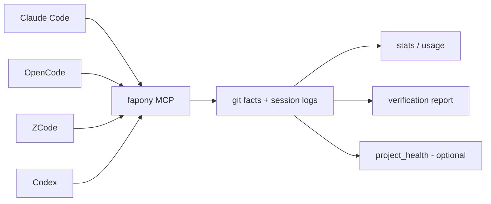
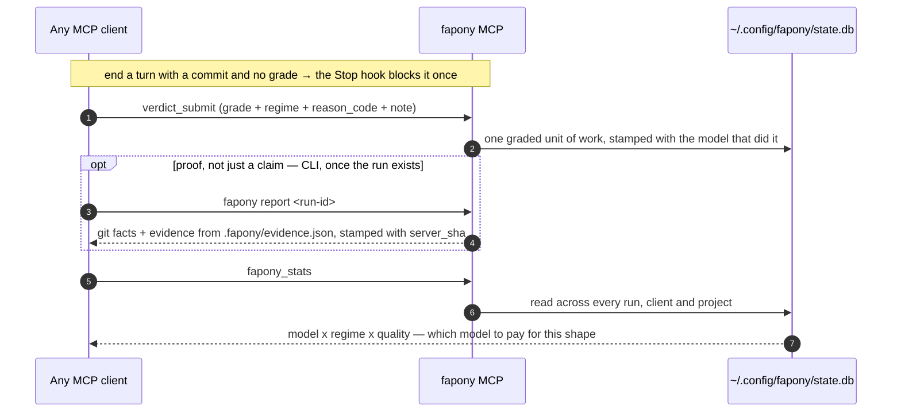
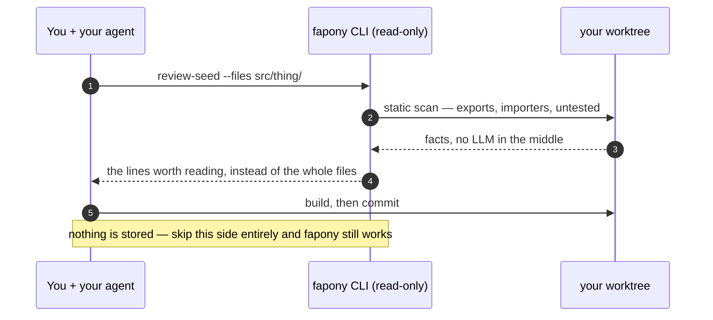
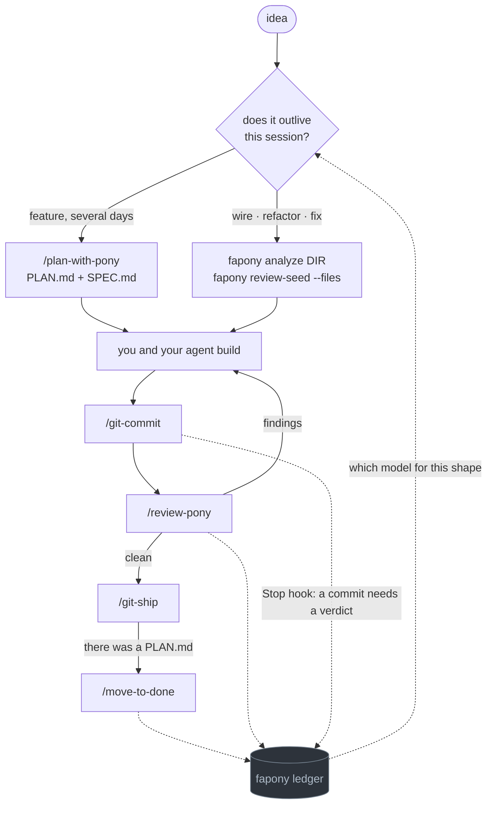

<p align="center">
  
</p>

# fapony

[](https://www.npmjs.com/package/fapony)

**Where did your tokens go?** fapony reads the session logs Claude Code, Codex, OpenCode and ZCode
already write, and puts them all on one yardstick — tokens, cost and time per model, per client,
per workflow. Nothing to instrument, no per-project setup, no waiting for data to accumulate: it
runs on the history already sitting on your disk.

<p align="center">
  
</p>

```bash
fapony usage-scan       # read the session logs already on your disk
fapony price-scan       # fetch the price table (needed once, for cost)
fapony usage-web        # every session you already have, all clients, one page
```

**Cost is the part your client probably isn't logging.** Of the four, only OpenCode writes a real
dollar figure into its session log — Claude Code, ZCode and Codex record `0`. fapony prices those
sessions at published list rates and labels the number `imputed`, so a figure you can compare
across clients exists at all. A model it can't find a rate for stays `unpriced`: nothing is
quietly counted as free.

<details>
<summary>full usage-web dashboard preview</summary>

<p align="center">
  
</p>

</details>

That is day one. Past that, fapony measures what coding agents actually do — rounds, pass/fail,
cost per grade — through 6 MCP tools any agent can call. If you juggle more than one agent, this is
the point: the numbers come from the same yardstick everywhere, so "which model earns its keep on
which kind of task" becomes a data question instead of a vibe. On top of measurement it checks
claims against git facts: handoff conformance, allowlisted evidence, a 6-grade verdict — with
everything the agent claimed but couldn't prove marked as such.

**What that question looks like answered, from one project's own ledger — the top of the `n≥5`
frontier (`fapony stats --mode verdict --regime code`):**

| model | tokens/pass | quality | n |
|---|---|---|---|
| `claude-opus-5` | 22.5M | 3.8 | 10 |
| `claude-sonnet-5` | 5.6M | 3.5 | 11 |
| `muse-spark-1.3-contributor-free` | 4.3M | 4.0 | 5 |

Same quality band, an 8× token spread — the kind of answer a session log can't give (it has tokens,
no grades) and a benchmark can't give either (it has grades, not your codebase). One caveat that's
on you to hold: work isn't randomly assigned to models, so a gap this size is a strong prior, not a
controlled trial — you likely route easy tasks to the cheap model already. `n≥5` is fapony's own
floor before a model counts toward the frontier at all; below that it's a data point, not a pick.

**The reason to keep it running is the third layer: knowledge accumulation.** Any single client already logs its own session — timing, tokens, tool calls. What none of them see is *across* runs, clients and task shapes: which model earns its keep on which kind of work **in this project**, at what token cost, graded by whoever reviewed it. Every verdict carries a `regime` (`code` / `fix` / `review` / `plan` / `inquiry` / `test`), and runs split by whether there was a plan at all — so "does planning beat diving in, and for which model" is a table, not an argument.

Three tiers, deliberately: **measurement ships today** and needs no per-project setup — raw facts nobody can call unfair. **Verification is the sharper edge** but stays beta until its evidence layer is hardened; fapony doesn't control your agent's flow, so it never promises "verified" as a headline. **Knowledge accumulation is the compounding one** — it's worthless on run 1 and gets more useful every run after, which is exactly why it's the layer competitors can't clone by copying a feature list.

Adopting it doesn't change your workflow. There is no loop to join and no framework to learn: install the MCP server, point your agent at it, and read the reports. fapony also ships plans, skills and read-only seed commands from its own dogfooding — those are conveniences, kept in their own section below, and deleting all of them costs you nothing the ledger can measure.

## What fapony is not

Stated up front, because the gap between these two things is where most tooling oversells:

- **It does not run your test suite.** The evidence collector runs an allowlist *you* write in
  `.fapony/evidence.json`, and never a command an agent proposes. No allowlist, no evidence — and
  the report says `not_run` rather than staying quiet.
- **It does not judge your code.** `verdict_submit` *stores* a verdict; a human or a reviewing
  agent supplies it. fapony is the ledger, not the judge.
- **`handoff_check` checks conformance, not correctness.** It verifies that what the agent claimed
  lines up with git facts and that it declared its uncertainty — not that the code works. Those are
  different guarantees and fapony only offers the first.
- **Nothing blocks.** There is no gate, no hook, no CI failure. Forget to call it and you are back
  to exactly the workflow you had.
- **Model attribution is inferred, not declared.** A gate is attributed to whichever client
  session was live in that worktree at that moment. When one model writes the code and another
  reviews and files the verdict, the grade lands on the reviewer. Reports label it `inferred`;
  read it as such.
- **The knowledge layer is empty on run 1.** It is worth something around run 5 and more every run
  after. That is the trade for it being the layer nobody can clone from a feature list.

## Quick start (MCP)

```bash
# 1. Install (needs Bun — https://bun.sh)
npm install -g fapony       # or: bun add -g fapony
#    from source instead:
#    git clone https://github.com/kire21b/fapony.git && cd fapony && bun install && bun link
#    note: `bun link` claims the global `fapony` bin by package name, not path — running it
#    from a second checkout silently repoints the command there. Re-run it in the one you want.

# 2. Wire it into your MCP client
fapony install                            # detects installed clients, asks which to wire
fapony install --all                      # skip the prompt, wire everything detected
#    use --platform <name> to force a specific client (bypasses detection)
#    zcode/codex need their config to exist first — open the app once if you never have
#    claude/opencode also symlink skill/<name>/ into ~/.claude/skills — an existing
#    skill of the same name is reported, never overwritten
# …or add it manually to any MCP client (e.g. Claude Desktop):
# { "mcpServers": { "fapony": { "command": "fapony", "args": ["mcp"] } } }

# 3. Measure — zero per-project setup
fapony usage-scan                         # scan the session logs already on disk → cache
fapony price-scan                         # fetch the OpenRouter price table → ~/.config/fapony/prices.json
fapony usage-web                          # dashboard; re-run the scans to refresh
#    both scans are manual by design — nothing fetches or re-reads session logs behind your back
#    ask your agent: "Run fapony_stats and fapony_usage — what has it cost me, per model?"

# 4. Verify (optional, per project) — scaffold the evidence allowlist
fapony init /path/to/your-worktree
#    edit .fapony/evidence.json to your real test/typecheck commands, then commit it
```

With `.fapony/evidence.json` in place, any graded run can be replayed as a report. This one is
a CLI command, not an MCP tool — the schemas cost every session of every client and no skill
called them (see [The 6 tools](#the-6-tools) below). Grade something first;
`verdict_submit` is what creates the run:

```bash
fapony report <run-id>        # run ids come from `fapony stats`
```

You get one report: git facts (files, commits, branch), handoff conformance (claims vs. reality), evidence from the allowlisted commands (pass/fail/timeout/unverified), a 6-grade verdict, and cost — with anything the agent claimed but couldn't prove marked as such.

Sections that have nothing to report say so (`not_run`, `unavailable`) rather than disappearing — a report with no evidence must not read like a report that passed.

Two details for the allowlist once it is under version control. If your `.gitignore` ignores `.fapony/` wholesale, re-include the file (dir before file): `**/.fapony/*`, then `!**/.fapony/evidence.json`. In a monorepo, give an app its own `apps/<app>/.fapony/evidence.json` — reports whose changed files all sit under that app use it; anything else uses the root one.

Two things worth knowing about the report header and budget:

- **`server_sha`** — every report is stamped with the git SHA of the fapony code that produced it, read once at server start. MCP servers are long-lived: after you edit fapony and don't restart the client, reports keep coming from the old build. Compare the stamp against `git log -1` in the fapony repo; if they differ, reconnect the server before trusting the result.
- **Evidence budget** — each allowlisted command gets `timeout_ms` (default 30s), and the whole report is capped at 180s total. A command that doesn't fit is reported as `timeout`, never as a pass. Time your real suite and set `timeout_ms` accordingly.

## How it fits



fapony never drives the agent. It sits on two sides of your work that never touch each
other, and **the rest of this README is organised along that line**: the ledger below is the
product, and everything under "The work side" after it is a convenience you can delete without
losing a single number.

| | The ledger | The work side |
|---|---|---|
| What it is | 6 MCP tools + a SQLite ledger | plans, skills, read-only seed commands |
| Needs | an MCP client | nothing — or your own tooling instead |
| Writes | one graded row per unit of work | nothing |
| Skip it and | there is no fapony | fapony still answers every question |

## The ledger — this is the product

One habit feeds it: grade a unit of work when it ends. Everything else on this page is
optional around that. `verdict_submit` needs no plan file, no skill and no `.fapony/`
directory — any agent that speaks MCP can call it, and calling it is what turns a pile of
session logs into an answer.

### One turn, end to end



The Stop hook is the only thing fapony does *to* you — once per turn, when a commit ends
ungraded. It never picks the grade; it cannot see whether the work held up.

### The 6 tools

| Tool | Tier | Purpose |
|------|------|---------|
| `plan_list` | discover | Plan files grouped by state — active / blocked / untouched / superseded / trackers — with a progress tally and each one's run history. Not a raw `ls`; see [Plans your agent can answer questions about](#plans-your-agent-can-answer-questions-about) |
| `fapony_stats` | measure | KPIs across runs: by-model (gates, fail rate, quality, tokens), by-grade, planned vs dove-in, regime x model, per-file risk; `group_by: reason_code\|plan\|file` for top-N slices; `mode: verdict` ranks models by quality vs tokens/pass instead of listing raw counts |
| `fapony_usage` | measure | Passive usage from OpenCode, ZCode, Claude Code, and Codex sessions (tokens, cost, by-model; `detail:true` adds per-step timing) |
| `verdict_submit` | verify | Store a 6-grade verdict (pass-excellent → uncertain) with a required `regime` — the task shape the grade applies to |
| `project_health_context` | recall | Known-patterns block for the files you are about to touch. Useful when a file does have history; measured across real repos, most do not (1-9% of shipped files come back under a `fix:` within two weeks), so it is optional — never a precondition for editing |
| `mem_find` | recall | Search the project's mem log read-only — decisions/bugs/notes keyed by `files[]`, `text`, `kind` (no default filter), `since`. "What was ever decided about this file?" in one call before editing |

The handoff/report family is CLI-only — the schemas cost every session of every client and no skill called them. `fapony report <run-id>` prints the full report for a run (facts + handoff conformance + evidence + verdict); `fapony report-web [file]` renders it as a static HTML page (overwrites `file` on every call — safe to reuse the same path). Run `bun run overview` for a one-shot shortcut that writes it to `/tmp/fapony-overview.html` and opens it. `fapony usage-scan` scans session logs and writes a cache file; `fapony usage-web [port]` serves a static HTML dashboard from that cache (no live scanning). Run `fapony usage-scan` periodically to keep data fresh.

Full protocol, adapter examples (bash, Python), and safety rules: [docs/mcp-handcheck.md](https://github.com/kire21b/fapony/blob/main/docs/mcp-handcheck.md).

### Verdict grades

Verification produces a quality grade, not just pass/fail:

| Grade | Meaning |
|-------|---------|
| `pass-excellent` | Ship-quality, no issues |
| `pass-good` | Minor nits, safe to ship |
| `pass-adequate` | Works, but could be better |
| `pass` | Meets minimum bar |
| `fail` | Needs fixes |
| `uncertain` | Reviewer can't judge — plan may have a problem |

### Why measure from the outside

- **Raw facts are hard to argue with.** Cost, rounds, diff sizes, pass rates — collected from git and session logs, not self-reported. A vendor can dispute a verdict as unfair; they can't dispute their own token count.
- **Agent platforms grading their own homework is a conflict of interest.** fapony is a separate layer that measures any agent the same way, which is what makes "model X vs. model Y" or "workflow A vs. workflow B" answerable with real data instead of vibes.
- **Verification stays honest about its limits.** The collector runs only commands listed in `.fapony/evidence.json`; commands proposed by the agent outside the allowlist are reported as *proposed — not executed*, never run. And because fapony doesn't control your agent's flow, verdicts are labeled as one signal — not promised as truth.

## The work side — conveniences, not the contract

Read-only, deterministic, and none of it writes to the ledger. These exist because they were
useful in this project's own dogfooding; use them, use your client's own search, or use
neither. **Nothing here is a precondition for anything in the section above.**

### A lookup instead of a file read



`review-seed --files` takes file names or a directory and answers "what is in here, who
imports it, what is untested" for roughly a thirtieth of the tokens reading those files costs.
That is the whole trick; there is no model in the middle.

### Skills

fapony ships five portable skills, each as `skill/<name>/SKILL.md` — the layout Claude
Code expects, so a client can symlink the directory rather than copy the file:

| Skill | Purpose | Trigger |
|-------|---------|---------|
| `skill/plan-with-pony/` | Draft plan + spec from "what's in your head" via conversation | `/plan-with-pony` |
| `skill/review-pony/` | Review as verification, wired to fapony: scope facts before (`review-seed`), verdict after | `/review-pony` |
| `skill/move-to-done/` | Archive a shipped PLAN into .fapony/done/ | `/move-to-done` |
| `skill/git-commit-conventional/` | Commit split by concern + conventional message | `/git-commit` |
| `skill/git-ship/` | Push branch, open PR with drafted title/body, merge, reset branch onto base | `/ship`, `/pr` |

### When to call what



**The fork at the top is load-bearing.** A plan file is an artifact for work the next session has
to pick up. Wiring, refactors and UI passes finish in one sitting and the PLAN.md gets archived
unread — so `/plan-with-pony` declines those itself and hands over the two seed commands instead.
Both arms meet at the same review and the same ledger.

**The dotted edges are the whole point.** Verdicts carry `regime` and `reason_code`, so the
ledger can answer the one question no single client can: *in this project, which model is worth
paying for this shape of work.* That is what flows back to the fork — not "this file broke once",
which fapony measured at a 1–9% base rate and demoted.

| Moment | Call | What fapony gets out of it |
|---|---|---|
| Starting anything | `/plan-with-pony` | decides plan-vs-seed, then reads back how this shape has gone |
| Before editing an unfamiliar file | `fapony review-seed --files` | nothing; it saves you reading the file |
| Before committing | `/git-commit` | nothing; it just keeps commits reviewable |
| Before merging | `/review-pony` | writes a verdict + `reason_code` + `regime` + note |
| Merging | `/git-ship` (`pr` / `land` on a team) | nothing; pure git plumbing |
| After it ships | `/move-to-done` | writes the ship verdict, closes the loop |
| Proving a finished run | `fapony report <run-id>` (CLI, not MCP) | git facts + allowlisted evidence, one page |

**Team flow.** `/git-ship pr` stops once the PR is open and hands you the URL; the reviewer does
their pass; `/git-ship land` merges it after approval. If the default branch requires reviews,
plain `/git-ship` detects that and behaves like `pr` on its own.

**What this is not.** It doesn't reduce your token bill — an agent that plans against known
failure patterns tends to spend fewer rounds getting there, but fapony measures that, it doesn't
cause it. Use `fapony_usage` to find out whether it actually happened for you rather than taking
the claim on faith.

`fapony install --platform claude` (or `opencode`) symlinks these directories into
`~/.claude/skills` rather than copying them, so `fapony update` refreshes every client
at once. A destination that already exists and isn't a fapony link is reported and left
alone — replace it by hand if you want fapony's version.

`plan-with-pony` is vendor-neutral — the SKILL.md *is* the prompt, so pipe it to any agent:

```bash
cat skill/plan-with-pony/SKILL.md | claude -p     # Claude Code
cat skill/plan-with-pony/SKILL.md | opencode run  # OpenCode
cat skill/plan-with-pony/SKILL.md | <your-agent>  # anything that reads stdin
```

Example plans produced by it live in [examples/](https://github.com/kire21b/fapony/tree/main/examples).

### Plans your agent can answer questions about

Plans stay markdown files in your repo — nothing moves into a database. Four optional
frontmatter keys are enough to make a folder of them queryable:

```yaml
---
kind: unit                     # tracker = a checklist that never finishes
status: blocked                # active | blocked | superseded
blocked_by: PLAN-documents.md  # a plan, or a sentence
blocks: PLAN-export.md         # ordering, stated once instead of buried in prose
---

# PLAN — month view in /quick

## TL;DR                       # 15 lines; the only part that changes mid-flight
- **Why:** two menu entries for the same data at different granularity
- [x] chunk 1 — month grid   `a1b2c3` 2026-09-13
- [ ] chunk 2 — move overdue out
```

Then ask your agent *"what's left, and what's blocked?"* — `plan_list` answers from the
frontmatter and from fapony's own run history, without reading a single 100KB plan body into
context (`format: "markdown"`):

```
## active — in order (2)
- [ ] PLAN-calendar — 1/3 · unblocks PLAN-export
- [ ] PLAN-export — never attempted
## blocked (1)
- [ ] PLAN-attendance — waiting: PLAN-documents.md
## untouched (14) · trackers (3)
done: 63 archived
```

**Plans with no frontmatter still work** — they are grouped by run history alone (attempted =
active, never attempted = untouched), so an existing folder of plans is queryable before anyone
annotates anything. Two details that keep it honest over years:

- The progress tally counts checkboxes in the **first `##` section only**, anchored by position
  rather than by the word "TL;DR" — so it works in any language, and a step list deeper in the
  file stays detail instead of becoming status.
- **There is no `MASTER.md`.** Every line of the list above is derived from frontmatter and
  checkboxes, so it cannot drift; a hand-kept master file always does.

The layout, and why archiving is a plain `git mv`:

```
.fapony/plan/PLAN-calendar.md    live
.fapony/done/PLAN-calendar.md    shipped — same name, same depth, so every relative
                                 link inside the file survives the move untouched
.fapony/spec/SPEC-calendar.md    specs are a reference library; they are never archived
```

Ship dates live in the plan's own header (`> ✅ **shipped 2026-09-13** (a1b2c3)`), not in the
filename — `grep -h shipped .fapony/done/*.md | sort` answers "what landed when" without paying
to rewrite every inbound link on every ship. Example plans, including an un-annotated one and an
archived one: [examples/](https://github.com/kire21b/fapony/tree/main/examples).

## CLI

```bash
# Verification & reporting
fapony mcp                               # MCP server (stdio JSON-RPC — 6 tools)
fapony report <run-id>                   # verification report for a run
fapony report-web [file]                 # static HTML report page
fapony usage-scan                        # scan session logs → cache (incremental, progress bar)
fapony price-scan                        # fetch model price table → prices.json (cache; query never fetches)
fapony usage-web [port]                   # live usage comparison dashboard from cache
fapony stats [--mode verdict [--regime code|fix|review|plan|inquiry|test]]  # KPIs: pass/stall rate, by-model, by-grade — --mode verdict ranks by quality/tokens instead
fapony digest [--since 7d|YYYY-MM-DD] [--format text|html] [--json] [--out FILE]  # single-page summary: decisions, open bugs, in-flight plans, cost, pass/fail — from what's already on disk
fapony plan-seed <name> [--spec] [--scope <path>]...  # write PLAN (+SPEC): frontmatter, 8 empty sections, prior-art list, ledger context; SPEC chunks carry signatures, every section capped — the agent fills the judgment
fapony review-seed [--staged|--commit <sha>|--range <a...b>|--files f1,f2,dir|--plan <PLAN.md>]  # read-only scope facts for a review (changed files, importers, untested, signatures, plan cross-check)

# Setup & maintenance
fapony init <path>                       # scaffold .fapony/ (plan/spec/memory/evidence)
fapony init-mem [--update]               # refresh the memory scaffold from the template
fapony install                            # detect installed clients, prompt to wire each
fapony install --all                      # wire all detected clients without prompting
fapony install --platform <name>          # force a specific client (bypasses detection)
fapony install --dry-run                  # show what would happen without writing files
fapony setup                             # interactive wizard: config + scaffold in one step
fapony update                            # self-update via git pull
fapony telemetry show|send               # opt-in only, default off — see https://github.com/kire21b/fapony/blob/main/TELEMETRY.md
fapony test                              # self-check
```

## Config

`fapony.config.json` lives in the fapony checkout and is gitignored (it's per-machine). Copy [fapony.config.example.json](https://github.com/kire21b/fapony/blob/main/fapony.config.example.json) for a complete working reference; every section is optional with sane defaults. Key fields:

- `worktrees` — name → absolute path mapping
- `review.maxRounds` — round cap enforced by the gate
- `memory` — shell commands for claim/close/add/kickoff, or `null` to default-wire when `.fapony/.memory/mem.ts` exists
- `paths` (`planDir`/`doneDir`/`specDir`/`memoryEntry`/`stateDir`) / `safety` — directory layout and the dangerous-command deny-list
- `usageWeb` — optional `{ port, hostname }` for `fapony usage-web` server defaults. Run `fapony usage-scan` first to populate the cache.

Env overrides: `FAPONY_CONFIG` (config file), `FAPONY_STATE_DIR` (state DB location; default `~/.config/fapony/`). Full schema, design decisions, and edge cases live with the code in the repo — this README intentionally doesn't duplicate them.

## Scope

**Supported:**
- MCP server — 6 tools via stdio JSON-RPC, works with any MCP client
- Measurement: cross-run KPIs by model/grade/value, per-file risk (graded touches vs. fails) + passive usage (tokens, cost)
- Model attribution across clients — resolved from the session log that was live when the verdict landed, so a verdict carries a model without the caller declaring one
- Zero setup beyond install: the two habits fapony depends on ship in the MCP `initialize` response, not in your rules file
- Verification (beta): handoff conformance, 6-grade verdicts, allowlisted evidence collector (`.fapony/evidence.json` — agent-proposed commands are never executed); reports stamped with the producing build's `server_sha`
- Vendor-neutral executor/reviewer roles — anything that reads stdin
- Memory integration via shell adapter, per project (configurable or default-wired)
- Opt-in telemetry, off by default ([TELEMETRY.md](https://github.com/kire21b/fapony/blob/main/TELEMETRY.md) lists exactly what leaves the machine)
- Bun-only; run state in SQLite via `bun:sqlite` (WAL mode)

**Not supported (yet):**
- A hosted or shared ledger for a team — `runs.worktree` is the only sharing key today, and it's a
  path, not an identity. If you want to try pointing two machines at the same ledger anyway,
  `FAPONY_STATE_DIR` can be set to a synced folder (Syncthing, a shared drive) — but SQLite's WAL
  mode does not tolerate concurrent writers over most network filesystems (NFS, Dropbox, iCloud
  Drive) and can corrupt the db under real contention. Treat this as an experiment you're accepting
  the risk on, not a supported path; nothing here is a substitute for a real shared-ledger server.
- Memory migration from `.fapony/.memory/log.jsonl`

## License

MIT
